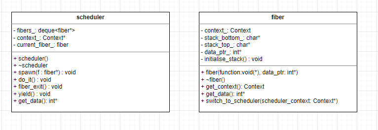

# ASP Assignment

## Fiber API implementation

## Description

This repo contains solutions to the tasks specified in the assignment brief.
The final product of this assignment is a simple runtime that can support cooperative tasks running within a single thread which is provided with the fiber and scheduler classes which provide the following functions:

- fiber_exit() - Terminates a fiber. Fiber returns control to the scheduler.
- get_data() - Returns the pointer to data passed in at fiber creation. Will return nullptr if no data ptr passed.
- yield() - Yields control back to the scheduler, fiber execution state is saved for resumption after being requeued.
- spawn() - Creates new task for execution by pushing fiber onto the scheduler queue. If called from outside of an executing fiber then the task will be added to queue but will not run until do_it() is called. If spawn is called within an executing fiber then the task will be added to the queue and executed when it is reached by the scheduler.
- do_it() - Runs the queued fibers and will return back when all queued fibers have completed.

## Task 1
Task 1 involved setting up the stack and basic use of the context switching api. (Link to repo for context switching api [here](https://gitlab.uwe.ac.uk/br-gaster/context))

Code for the first pseudocode example can be found [here](task_1_example_1.cpp) which can be compiled with: clang++ -std=c++17 task_1_example_1.cpp context.o.
The output of the file can be seen [here](screenshots/part_1_example_1.png)

The next part of task 1 was setting up the stack for Sys V ABI alignment and layout and demonstrating switching between "fiber" contexts. Code for the second pseudocode example can be found [here](task_1_example_2.cpp) and also [a screenshot of the output.](screenshots/part_1_example_2.png)

## Task 2
After simulating the behaviour of fibers in the previous task, task 2 involved creating a class to represent a fiber and additionally a scheduler class.

The first part of this task was to rework the "foo" example in task 1 to demonstrate our new fiber class. The code for this example is found in [task_2_example_1](task_2_example_1.cpp) and also screenshot of [output.](part_2_example_1.png)

The next part of this task was to create a scheduler class to queue and execute fibers in a round robin fashion. We were recommended in the assignment brief to use std::deque for the queue.

For the second pseudocode example we were tasked to demonstrate our scheduler running two fibers consecutively by spawning (pushing onto the queue) and then running them with do_it and having the fibers return control to the scheduler by calling fiber_exit(). The code for this part of the task can be found in [task_2_example_2](task_2_example_2.cpp) and also [a screenshot of the output.](screenshots/part_2_example_2.png) In reply to the question of "Why did we make s global" on the assignment brief, I would say it is because it would be pretty annoying to call s.fiber_exit() from inside a fiber if s had been declared locally within main, without having to modify the fiber class to access the scheduler methods etc. (I'm sure there are other ways of doing it.)

The final pseudocode example is meant for us to demonstrate fibers cooperating to do something (in this case modify an integer value). A pointer to an integer is passed to both fibers on creation, and as it is passed by reference, both fibers are able to modify the contents. The code for this can be found in [task_2_example_3](task_2_example_3.cpp) with accompanying screenshots of [output](screenshots/part_2_example_3.png).

## Task 3
For task 3 we were asked to implement the yield function, which when called would suspend the currently executing fiber, save the stack pointer and pointer to function body and then requeue the fiber at the back of the queue to be executed when its' time comes. I did waste some time attempting to have a fiber constructor for lambda functions because I thought it would neaten up the testing file but it kept getting seg faults and wasn't sure why so binned it.

The class definitions for fiber and scheduler can be found in their respective header files, [fiber.hpp](fiber.hpp) and [scheduler.hpp](scheduler.hpp), and the source code for the api is stored in [fibers.cpp](fibers.cpp). There are also class diagrams of both below.

For testing my "yield" function as well as my scheduler and fiber classes, I used the [simpletest](https://github.com/kudaba/simpletest) framework for simple unit tests.

Basic Fiber Execution Test - Creates fiber and pass data on creation. Validates that fiber can retrieve and modify passed data.

Mutiple FIber Execution Test - Spawns mutiple fibers and validates that they run and that if a call to get_data() after do_it() has concluded that a nullptr is returned.

Yield Test - Spawns 2 fibers and pass them both pointers to the same data. Data is modified within the first fibers body, output the data value, then yield. The other fiber increments the integer and outputs the value before the first fiber is resumed to modify the value a final time by a different amount. The output is captured to validate that the data is modified in the correct order. 

Spawn from Fiber - Initialise a fiber which will then spawn another from within its function body. The second spawned fiber should be able to modify the passed data value and the result is validated.

Tests can be run using: clang++ -std=c++17 -o task_3_tests -I external/simpletest task_3_tests.cpp fibers.cpp context.o external/simpletest/simpletest.cpp

